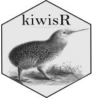

<!-- README.md is generated from README.Rmd. Please edit that file -->

```{r setup, include = FALSE}
knitr::opts_chunk$set(
  collapse = TRUE,
  comment = "#>",
  fig.path = "tools/readme/README-",
  out.width = "100%"
)

```

# kiwisR 


[](https://opensource.org/licenses/MIT)
[](https://cran.r-project.org/package=kiwisR) [](https://CRAN.R-project.org/package=kiwisR)

## Overview
A wrapper for querying [KISTERS WISKI databases](https://www.kisters.net/NA/products/wiski/) via the [KiWIS API](https://water.kisters.de/en/technology-trends/kisters-and-open-data/). Users can toggle between various databases by specifying the `hub` argument. Currently, the default hubs are:

* _kisters_ : [KISTERS KiWIS Example Server](http://kiwis.kisters.de/KiWIS2/index.html)
* _swmc_ : [Ontario Surface Water Monitoring Centre](https://www.ontario.ca/page/surface-water-monitoring)
* _quinte_ : [Quinte Conservation Authority](http://quinteconservation.ca/site/)

All data is returned as tidy [tibbles](https://CRAN.R-project.org/package=tibble). 

## Installation
You can install ```kiwisR``` from CRAN:

```{r eval = FALSE}
install.packages('kiwisR')
```

To install the development version of ```kiwisR``` you first need to install ```devtools```. 

```{r eval = FALSE}
if(!requireNamespace("devtools")) install.packages("devtools")
devtools::install_github('rywhale/kiwisR')
```

Then load the package with

```{r eval = FALSE,message=FALSE,warning=FALSE}
library(kiwisR)
```

```{r eval=TRUE,message=FALSE,warning=FALSE, include=FALSE}
devtools::load_all()
```

## Usage

### Get Station Information

#### All Available Stations

By default, ```ki_station_list()``` returns a tibble containing information for all available stations for the selected hub. 

```{r}
# With swmc as the hub
ki_station_list(hub = 'swmc')
```

#### Within Bounding Box

You can also specify a bounding box to look within for stations. The bounding box should be either

* A vector like this ```c(min_x, min_y, max_x, max_y)```
* Or a comma separated string like this ```"min_x,min_y,max_x,max_y"```

```{r}
# With vector
my_bounding_box <- c("-80.126038", "43.458297", "-79.002481", "43.969098")
my_stations <- ki_station_list(
  hub = 'swmc', 
  bounding_box = my_bounding_box
  )

my_stations

# With comma separated string
my_bounding_box <- "-80.126038,43.458297,-79.002481,43.969098"
my_stations <- ki_station_list(hub = 'swmc', bounding_box = my_bounding_box)
my_stations

```

#### By Search Term
You can also narrow search results using a search term. This supports the use of ```*``` as a wildcard.

```{r}
# All stations starting with 'A'
my_stations <- ki_station_list(
  hub = 'swmc', 
  search_term = "A*"
  )

my_stations

# All stations starting with 'Oshawa'
my_stations <- ki_station_list(
  hub = 'swmc', 
  search_term = "Oshawa*"
  )

my_stations
```

#### By Group
You can retrieve a list of available station and time series groups using ```ki_group_list```

```{r}
all_groups <- ki_group_list(hub = 'swmc')
all_groups
```

You can then pass values from the ```group_id``` column to ```ki_station_list``` to filter for only stations
included in the group

```{r}
group_stations <- ki_station_list(
  hub = 'swmc', 
  group_id = '169270'
  )

group_stations
```

### Get Time Series Information

You can use the ```station_id``` column returned using ```ki_station_list()``` to figure out
which time series are available for a given station. 

By default, this will also return ```to``` and ```from``` columns 
indicating the period of record for that time series. You can speed
up queries by setting the ```coverage``` argument to `FALSE`. 


#### One Station

```{r}
# Single station_id
available_ts <- ki_timeseries_list(
  hub = 'swmc', 
  station_id = "144659"
  )

available_ts

str(available_ts)

```

#### Multiple Stations
If you provide a vector to ```station_id```, the returned tibble will have all the
available time series from _all_ stations. They can be differentiated using the 
```station_name``` column.

```{r}
# Vector of station_ids
my_station_ids <- c("144659", "144342")

available_ts <- ki_timeseries_list(
  hub = 'swmc', 
  station_id = my_station_ids
  )

available_ts

unique(available_ts$ts_name)
```

### Get Time Series Values

You can now use the ```ts_id``` column in the tibble produced by ```ki_timeseries_list()``` to query values for
chosen time series. 

By default this will return values for the past 24 hours. You can specify the dates you're interested in
by setting ```start_date``` and ```end_date```. These should be set as date strings with the format 'YYYY-mm-dd'. 

You can pass either a single or multiple ```ts_id```(s). 

#### One Time Series

```{r}
# Past 24 hours
my_values <- ki_timeseries_values(
  hub = 'swmc', 
  ts_id = '966435042'
  )

my_values
```

#### Multiple Time Series

```{r}
# Specified date, multiple time series
my_ts_ids <- c("1125831042","908195042")
my_values <- ki_timeseries_values(
  hub = 'swmc',
  ts_id = my_ts_ids,
  start_date = "2015-08-28",
  end_date = "2018-09-13"
  )

my_values

unique(my_values$ts_name)
```

## Using Other Hubs
You can use this package for a KiWIS hub not included in this list by feeding the location of the API service to the ```hub``` argument.

For instance:
If your URL looks like 

`http://kiwis.kisters.de/KiWIS/KiWIS?datasource=0&service=kisters&type=queryServices&request=getrequestinfo`

specify the ```hub``` argument with

`http://kiwis.kisters.de/KiWIS/KiWIS?`

If you'd like to have a hub added to the defaults, please [Submit an Issue](https://github.com/rywhale/kiwisR/issues)
