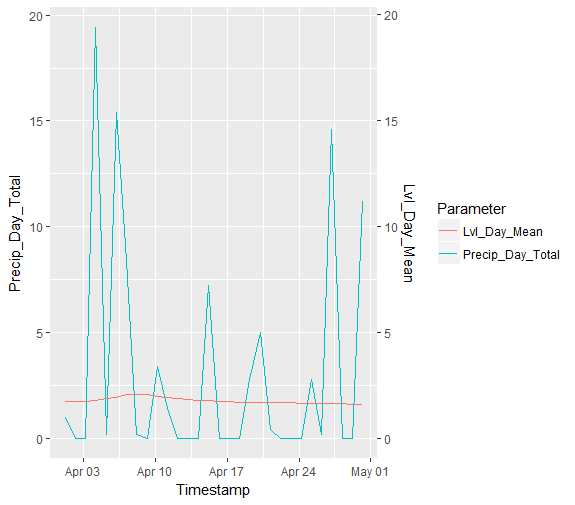

Simple Use Case
================

Grab Station Information
------------------------

We'll begin by getting some information for the station we're interested in. Note that we also specify the data hub.

``` r
# Search stations ending with "Peterborough"
PtboStations <- searchStations(hub = "swmc", search.trm = "*Peterborough")

# Display results
PtboStations

                   station_name station_id station_latitude station_longitude
1 Jackson Creek at Peterborough     144619        44.302925       -78.3211367
```

There's only one station ending with 'Peterborough', Jackson Creek at Peterborough. Let's see what timeseries are available.

``` r
# Get station_id for Jackson Creek at Peterborough
JacksonID <- PtboStations$station_id[[1]]

# Get timeseries list for that station
JacksonTS <- getTimeseriesList(hub = "swmc", station.id = JacksonID)

# Display timeseries list
JacksonTS

                      ts_name      ts_id
1                     BAT.1.O  948473042
2                 HRel.DayMax  948488042
3                    HRel.1.O  948485042
4          JACKSONP.HRel.15.P  948487042
5          JACKSONP.HRel.15.O  948486042
...
```

Now we can grab the ts\_id(s) we're interested in. Let's go for Precip.Day.Total and LVL.Day.Mean

``` r
PrecipID <- JacksonTS$ts_id[[22]]
LvlID <- JacksonTS$ts_id[[93]]
```

Now we're ready to get some values for those timeseries. We'll see what was going on there the first week of April 2017 by specifying the 'from' and 'to' variables.

``` r
Precip <- getTimeseriesValues(hub = "swmc", ts.id = PrecipID, from = "2017-04-01", to = "2017-04-30")
Lvl <- getTimeseriesValues(hub = "swmc", ts.id = LvlID, from = "2017-04-01", to = "2017-04-30")

# Print the first six rows of Precip
head(Precip)

            Timestamp Value(millimeter)
1 2017-04-01 00:00:00               0.0
2 2017-04-01 00:15:00               0.0
3 2017-04-01 00:30:00               0.0
4 2017-04-01 00:45:00               0.4
5 2017-04-01 01:00:00               0.2
6 2017-04-01 01:15:00               0.2

# Print the first six rows of Lvl
head(Lvl)

            Timestamp Value(meter)
1 2017-04-01 00:00:00         1.74
2 2017-04-01 00:05:00         1.74
3 2017-04-01 00:10:00         1.74
4 2017-04-01 00:15:00         1.74
5 2017-04-01 00:20:00         1.74
6 2017-04-01 00:25:00         1.74
```

Finally, let's stick the two timeseries together based on common time stamps and graph this new dataframe using ggplot.

``` r
# Load necessary libraries 
library(dplyr)
library(ggplot2)

# Join timeseries dataframes on "Timestamp" column
# this will drop any rows with time stamps that aren't shared
MultiTS <- left_join(Precip, Lvl, by = "Timestamp")

# Rename columns to match timeseries parameters
names(MultiTS) <- c("Timestamp", "Precip_Day_Total", "Lvl_Day_Mean")

# Construct plot
ggplot(data = MultiTS, aes(x = Timestamp)) + 
  # Add Precip
  geom_line(aes(y = Precip_Day_Total, color = "Precip_Day_Total")) + 
  # Add Lvl
  geom_line(aes(y = Lvl_Day_Mean, color = "Lvl_Day_Mean")) + 
  # Add second axis for Lvl
  scale_y_continuous(sec.axis = sec_axis(~., name = "Lvl_Day_Mean")) + 
  # Legend title
  labs(color = "Parameter")
```

Here's what that graph looks like


